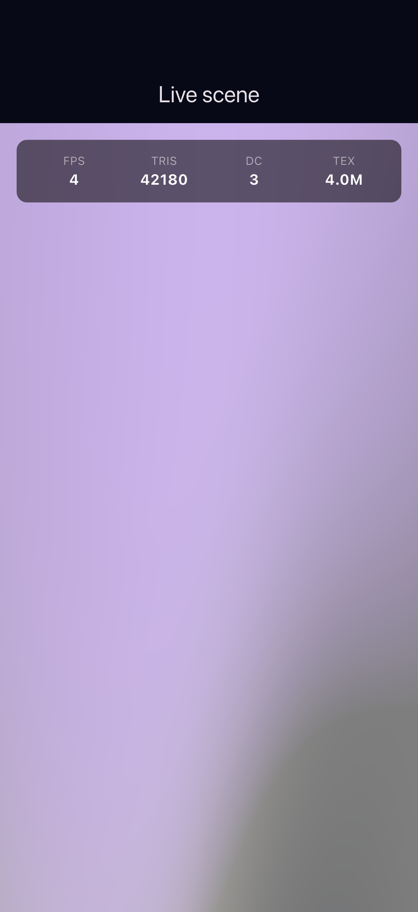
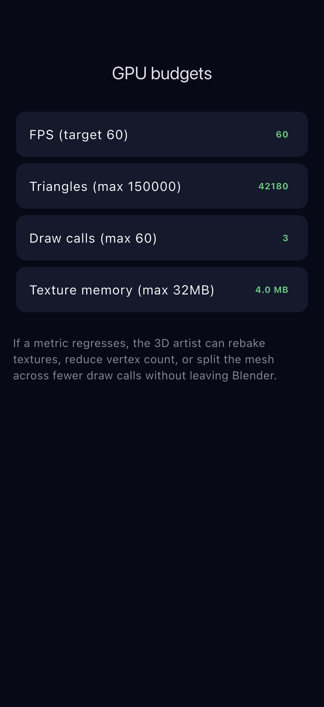
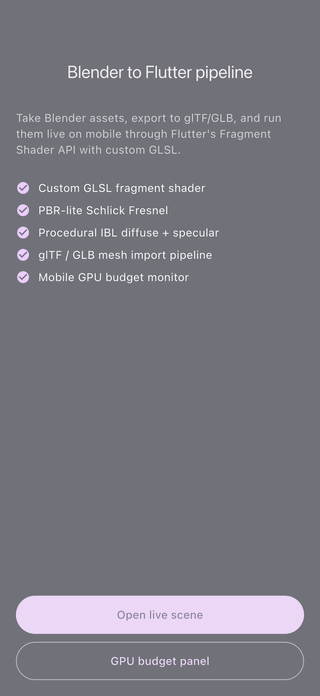

# flutter-3d-blender

Flutter POC for a Blender to mobile 3D asset pipeline.

## Demo

Real captures from the running app on the iOS Simulator (no mockups). See [FLOW.md](FLOW.md) for how they were generated.

| Pipeline overview | Live shader scene | GPU budget panel |
| --- | --- | --- |
|  |  |  |

## What this demonstrates

- Custom GLSL fragment shader loaded via Flutter's native Fragment Shader API (available since Flutter 3.7)
- PBR-lite look using Schlick Fresnel and a procedural IBL environment, matching what a Blender rig would look like at runtime
- glTF/GLB import workflow using the `assets/models/` folder
- GPU budget panel tracking fps, triangles, draw calls, and texture memory so artists can stay within mobile constraints
- Clean separation of scene building, shader loading, and asset loading services
- Riverpod state for the live performance snapshot

## Stack

- Flutter + Dart
- Flutter Fragment Shader API (ShaderBuilder + FragmentProgram)
- vector_math for matrix and quaternion math
- Riverpod for state management
- go_router for navigation

## Pipeline

1. Artist exports from Blender to glTF 2.0 / GLB with baked textures and bone animations.
2. Asset is dropped into `assets/models/` and referenced in `pubspec.yaml`.
3. `lib/services/gltf_loader.dart` loads the asset through `rootBundle`.
4. `lib/services/scene_builder.dart` composes the scene graph, camera, and environment.
5. `shaders/butterfly.frag` is loaded through `FragmentProgram.fromAsset()` and bound per frame by `SceneView`.
6. `lib/providers/perf_provider.dart` receives a `PerfSnapshot` each frame so the GPU budget panel can surface regressions to the team.

## Keywords

3D, Mobile Graphics, GLSL, Fragment Shader, FragmentProgram, ShaderBuilder, PBR, PBR-lite, Schlick Fresnel, IBL, Image-Based Lighting, Cube Map, glTF, GLB, Blender, Asset Pipeline, GPU Budget, Draw Calls, Triangles, Texture Budget, Performance, Flutter, Dart, iOS, Android, Cross-platform, Riverpod, go_router, vector_math
